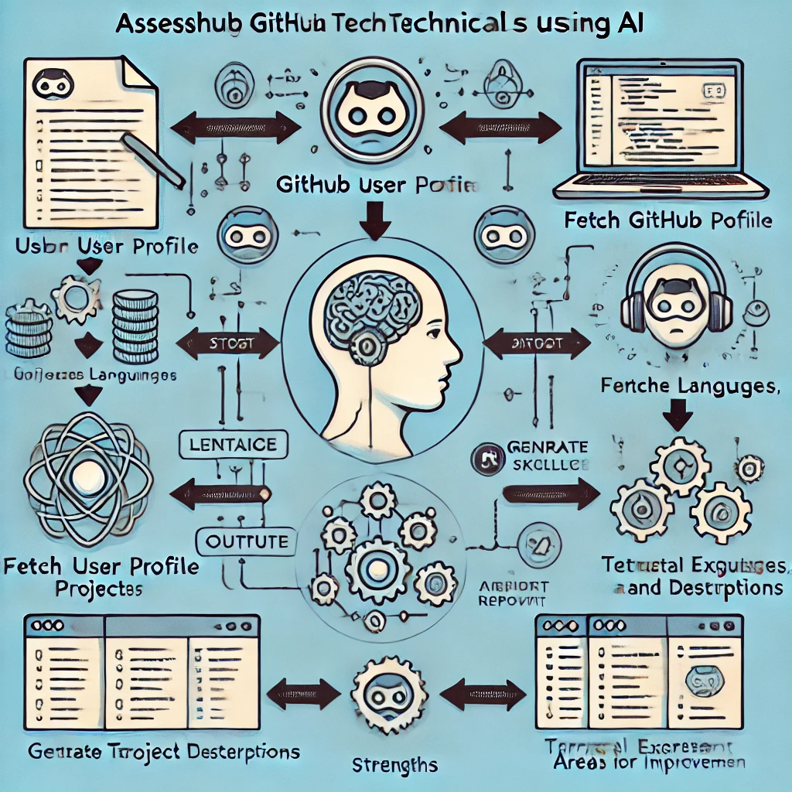

# AI Agent for Technical Skills Assessment

## Overview
This project involves developing an AI agent that can assess the technical skills of an individual based on their GitHub profile. The agent fetches relevant data from the user's GitHub profile, processes it, and provides insights on their technical abilities.

The AI agent is built using **Phidata** for agent development and the **Groq API** for handling large language models (LLM) to analyze the fetched data.

## Features
- **Skill Analysis**: Analyze coding languages, repositories, and contributions to assess technical skills.
- **GitHub Profile Data Fetching**: Fetch relevant public data from GitHub profiles (without requiring an API key).
- **Natural Language Processing (NLP)**: Utilize Groq API’s LLM capabilities to process and summarize the GitHub data.

## How it Works
The AI agent follows these steps to analyze a GitHub profile:

1. **Profile Data Fetching**: It scrapes public data from a specified GitHub user’s profile.
2. **Data Processing**: The fetched data is then processed and structured.
3. **Skill Assessment**: Using LLM models, the agent analyzes the data to extract key technical skills based on repositories, contributions, and coding languages.
4. **Report Generation**: A summary report is generated to assess the user's technical skills.



## Installation

1. Clone the repository:

    ```bash
    git clone https://github.com/your-repository.git
    ```

2. Install dependencies:

    ```bash
    pip install -r requirements.txt
    ```

3. Set up your development environment (e.g., Python, necessary libraries).

## Usage

1. Run the agent with a GitHub username:

    ```bash
    python agent.py --username <GitHubUsername>
    ```

2. The agent will process the data and provide a report on the user's technical skills.

## License
This project is licensed under the MIT License - see the [LICENSE](LICENSE) file for details.

## Contributing
1. Fork the repository.
2. Create a new branch (`git checkout -b feature-branch`).
3. Commit your changes (`git commit -am 'Add new feature'`).
4. Push to the branch (`git push origin feature-branch`).
5. Open a pull request.

## Acknowledgements
- **Phidata**: For providing the framework for building the AI agent.
- **Groq API**: For enabling large language model-based analysis.
- **GitHub**: For providing the platform to fetch public profiles.

